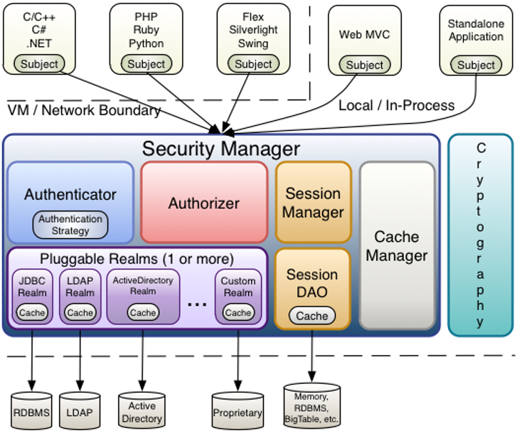

# 1 shiro权限验证框架

- Shiro 架构包含三个主要部分：

  - Subject :主体对象，负责提交用户认证和授权信息。
  - SecurityManager：安全管理器，负责认证，授权等业务实现。
  - Realm：领域对象，负责从数据层获取业务数据。

  


- Shiro框架进行权限管理时,要涉及到的一些核心对象,主要包括:**认证管理对象,授权管理对象,会话管理对象,缓存管理对象,加密管理对象以及Realm管理对象(领域对象:负责处理认证和授权领域的数据访问题)等**。
  - Subject（主体）:与软件交互的一个特定的实体（用户、第三方服务等）。
  - SecurityManager(安全管理器) :Shiro 的核心，用来协调管理组件工作。
  - Authenticator(认证管理器):负责执行认证操作。
  - Authorizer(授权管理器):负责授权检测。
  - SessionManager(会话管理):负责创建并管理用户 Session 生命周期，提供一个强有力的 Session 体验。
  - SessionDAO:代表 SessionManager 执行 Session 持久（CRUD）动作，它允许任何存储的数据挂接到 session 管理基础上。
  - CacheManager（缓存管理器）:提供创建缓存实例和管理缓存生命周期的功能。
  - Cryptography(加密管理器):提供了加密方式的设计及管理。
  - Realms(领域对象):是shiro和你的应用程序安全数据之间的桥梁。





- shiro项目依赖：

```xml
<dependency>
     <groupId>org.apache.shiro</groupId>
     <artifactId>shiro-spring</artifactId>
     <version>1.5.3</version>
</dependency>
```

- shiro的两个主要过程是认证和授权，分别对应Authenticator和Authorizer  


# 思考

- **不使用shiro框架如何完成认证操作？filter，intercetor**
- **不使用shiro如何完成授权操作？intercetor，aop**


# 重点和难点分析

1. shiro 认证过程分析及实现(判定用户身份的合法性)。
2. Shiro 授权过程分析及实现(对资源访问进行权限检测和授权)。
3. Shiro 缓存，会话时长，记住我等功能实现。


# 常见FAQ

1. 说说shiro的核心组件?
2. 说说shiro的认证流程,你如何知道的,为什么要认证?
3. 说说shiro的授权流程,你如何知道流程是这样的,为什么要进行授权?
4. Shiro中内置缓存应用实现?为什么使用此缓存?是否可以使用第三方缓存?
5. Shiro中的记住我功能如何实现?为什么要使用这个功能?
6. Shiro中会话session的默认时长是多少,你怎么知道的?


