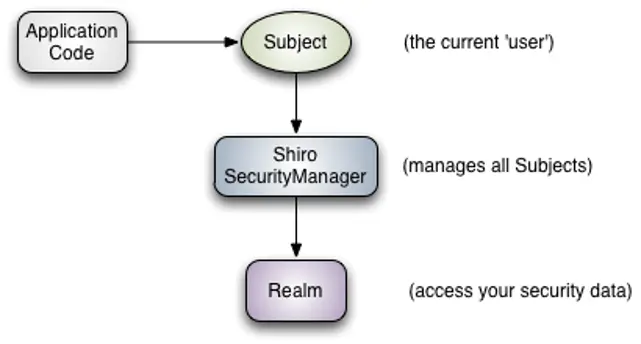

# 1 shiro权限验证框架

- Shiro 架构包含三个主要部分：

  - Subject :主体对象，负责提交用户认证和授权信息。
  - SecurityManager：安全管理器，负责认证，授权等业务实现。
  - Realm：领域对象，负责从数据层获取业务数据。

  

- Shiro框架进行权限管理时,要涉及到的一些核心对象,主要包括:**认证管理对象,授权管理对象,会话管理对象,缓存管理对象,加密管理对象以及Realm管理对象(领域对象:负责处理认证和授权领域的数据访问题)等**。

